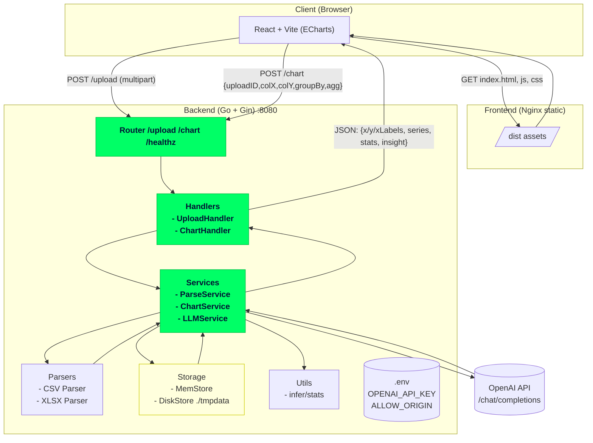
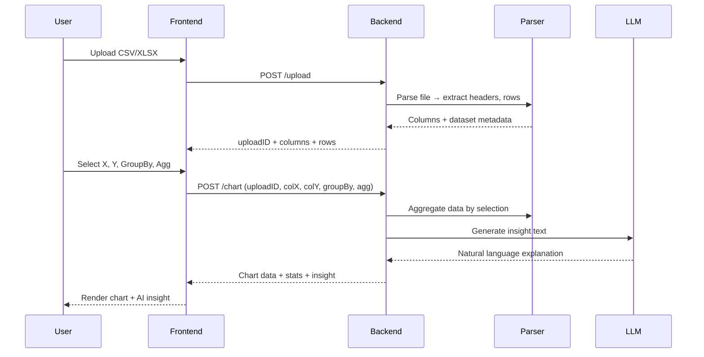

## 📬 Kontak

* **Author**: Kukuh Tripamungkas Wicaksono
* **Email**: [kukuhtw@gmail.com](mailto:kukuhtw@gmail.com)
* **WhatsApp**: [wa.me/628129893706](https://wa.me/628129893706)
* **LinkedIn**: [linkedin.com/in/kukuhtw](https://id.linkedin.com/in/kukuhtw)

---

# 📊 ChartInsight

**ChartInsight** is a lightweight full-stack web app that lets users upload CSV/XLSX files, generate interactive charts, and receive AI-powered insights.  
It combines a **Go backend** (file parsing, aggregation, OpenAI API call) and a **React + Vite frontend** (chart rendering with ECharts).

---
[](https://youtu.be/g-K9jKyFE8Q)
---

---

## ✨ Features

- 📂 **Upload CSV/XLSX** → Supports `.csv`, `.xls`, `.xlsx`  
- 🔎 **Select Columns** → Pick X/Y axis, optional Group By, and aggregation (`avg`, `sum`, `min`, `max`)  
- 📊 **Interactive Charts** → Rendered with [ECharts](https://echarts.apache.org)  
- 🤖 **AI Insights** → Calls OpenAI API to generate natural-language explanations of the chart  
- ⚡ **Modern Stack**:  
  - Backend: **Go + Gin**  
  - Frontend: **React + Vite + TypeScript**  
  - Containerized with **Docker Compose**  

---

## 🗂️ Project Structure

```

csvxlchart/
├─ backend/                     # Go API
│  ├─ cmd/server/main.go        # Entry point
│  ├─ internal/
│  │  ├─ handlers/              # Upload & chart endpoints
│  │  ├─ services/              # Parsing, chart, LLM
│  │  ├─ parsers/               # CSV/XLSX adapters
│  │  ├─ storage/               # Temp file storage
│  │  ├─ models/                # DTOs
│  │  └─ utils/                 # Helpers
│  ├─ Dockerfile
│  └─ go.mod / go.sum
│
└─ frontend/                    # React (Vite)
├─ src/
│  ├─ pages/UploadPage.tsx   # File upload page
│  ├─ pages/ChartPage.tsx    # Chart + Insights page
│  ├─ components/            # UI Components
│  ├─ api/                   # API clients
│  ├─ hooks/                 # React hooks (upload, chart)
│  └─ types/                 # Shared types
├─ Dockerfile
└─ package.json

````

---

## 🚀 Getting Started

### 1. Clone Repo
```bash
git clone https://github.com/kukuhtw/chartinsight.git
cd chartinsight
````

### 2. Setup Environment

Copy env template and set your **OpenAI API key**:

```bash
cp backend/.env.example backend/.env
# edit backend/.env
OPENAI_API_KEY=your_api_key_here
ALLOW_ORIGIN=*
```

### 3. Run with Docker Compose

```bash
docker-compose up --build
```

This will start:

* Backend API → [http://localhost:8080](http://localhost:8080)
* Frontend UI → [http://localhost:5173](http://localhost:5173)

---

## 🖥️ Usage

1. Go to **Upload Page**
   → Upload a CSV/XLSX dataset
   → Backend parses headers

2. Navigate to **Chart Page**
   → Select X, Y, Group By (optional), and Aggregation
   → Click **Render Chart**

3. View Results
   → Interactive chart displayed
   → AI-generated natural language insight appears below

---

## 🔧 Tech Stack

* **Backend**: Go 1.22+, Gin, Excelize, UUID
* **Frontend**: React 18, Vite 5, TypeScript, ECharts
* **AI Integration**: OpenAI API
* **Infra**: Docker, Docker Compose, Nginx

---

## 📦 API Endpoints

### `POST /upload`

Upload CSV/XLSX file

**Response:**

```json
{
  "uploadID": "uuid",
  "columns": ["Depth_m", "ROP_m_per_hr", "Weight_on_Bit_kN"],
  "rows": 1200
}
```

### `POST /chart`

Generate chart + insight

**Request:**

```json
{
  "uploadID": "uuid",
  "colX": "Depth_m",
  "colY": "ROP_m_per_hr",
  "groupBy": "Well_ID",
  "agg": "avg"
}
```

**Response:**

```json
{
  "xLabels": ["Well-01","Well-02"],
  "series": [{ "name": "ROP", "data": [12.3, 10.5] }],
  "stats": { "n": 1200, "min": 8, "max": 15, "mean": 11.2, "std": 1.4 },
  "insight": "As depth increases, ROP shows a decreasing trend across wells."
}
```
## 🏗️ Architecture Diagram


---

## 🧩 Sequence Diagram



---

## 📝 License

MIT © 2025 [Kukuh Tripamungkas Wicaksono](https://id.linkedin.com/in/kukuhtw)

---

⚡ **ChartInsight** → *From raw CSV/XLSX to meaningful charts + AI insights in seconds.*

```

---

```


